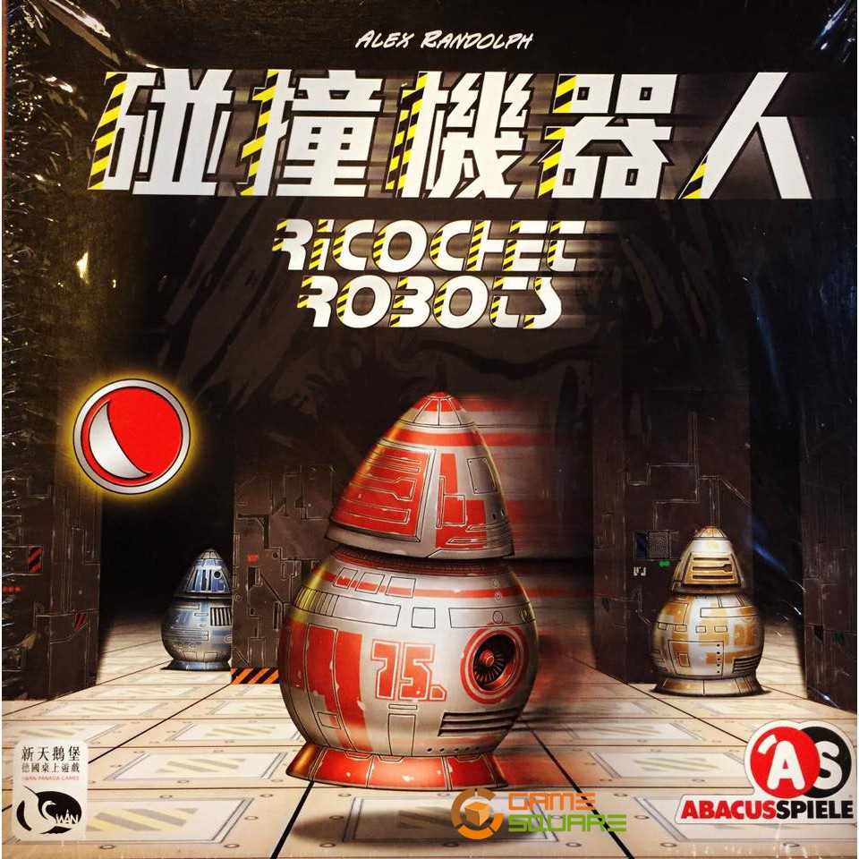
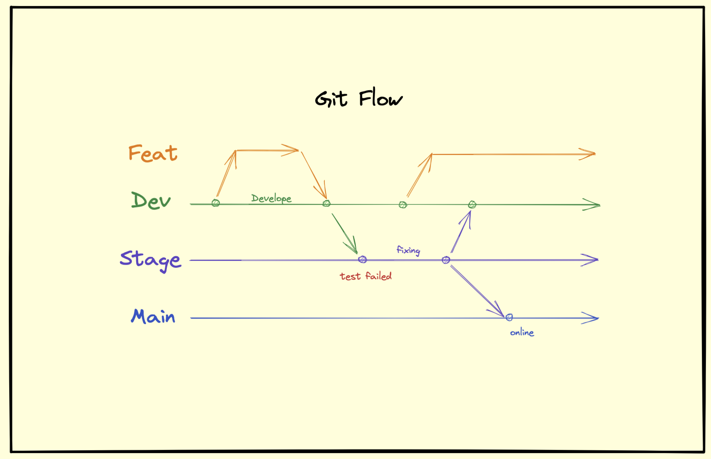

# Ricochet-Robots

# Introduction

這個遊戲是在一個方格棋盤上面進行的，每一回合都會有一個目標格子，玩家們需要想出最少的移動步驟來將指定的機器人移動到目標格子上，當某一位玩家想出一個解法時，他會喊出一個數字，這個數字代表解法的步數（也就是將機器人移動到指定格子上的步數），比如 A 玩家喊 5 步，隨後沙漏會開始計時，這時候其他玩家要試著找出更小步數的解法來挑戰 A 玩家，比如 B 玩家喊出 4 步，那麼沙漏將重新開始計時，直到沒有玩家能夠喊出更少的步數時，就進入行使階段，依序由喊出步數最小的玩家開始展示自己的方案，一旦有玩家成功實現了自己的方案，則該玩家贏得此局。  

遊戲流程大概是這樣子：  
   - 發布任務（哪個機器人移動到哪個格子）
   - 競標（提出最小步數方案者得標）
   - 行使（由得標者開始移動機器人）
   - 結算（計分）  
TODO: 補流程圖
# My Practice Stack
- Practice Stack  初級組合：
   - Three-layered architecture
   - CI/CD Pipeline
   - BDD (Example Mapping）
   - ATDD 
- Git
   - Write Good Git Commit Message
   - [Gitflow]()

# Tech Stack
- Backend
   - Golang
   - Postgres
- Frontend
   - N/A

## 這邊會紀錄一下團隊對於各個 Practice Stack 的理解，並且對批評與指教是開放的。
---
### BDD(Behavior Driven Design)

**BDD 和 TDD 的差異？**  
*TDD*
1. 先寫測試再開發。
1. 依循「紅燈／綠燈／重構」循環（Red/Green/Refactor）。
1. 優點是在初期就確保測試程式的撰寫，而且更容易在初期定義出更貼近使用方的介面。

*BDD*  
BDD 要解決什麼問題？  非技術人員難以參與討論  
那麼 BDD 怎麼解決這些問題呢？  **在寫測試前先寫測試規格書(Gherkin文件)。**  
這份測試規格會用更接近人類語意的自然語言來描述軟體功能和測試案例。  

補充:
什麼是 Gherkin 文件？  Gherkin是一種語法結構  
它不是單純的敘述文件，而是一份「可以被執行的規格」，是可以被轉成自動化測試的。
```
Feature: 一句話簡介這份規格書所涵蓋的軟體功能
  對這份規格書更多的介紹 (非必要，不影響自動測試)
  介紹....
  介紹....

  Scenario: 要測試的測試案例 1
    Given 前提條件是....
    When 我做了某件事....
    Then 結果應該得到...

  Scenario: 要測試的測試案例 2
    Given 前提條件是....
    When 我做了某件事....
    Then 結果應該得到...
```

> Reference  
[TDD 開發五步驟，帶你實戰 Test-Driven Development 範例](https://tw.alphacamp.co/blog/tdd-test-driven-development-example)  
[BDD/TDD差別是什麼？ 手把手用 Cucumber 實作示範BDD](https://tw.alphacamp.co/blog/bdd-tdd-cucumber-behaviour-driven-development)

---
### 怎樣算是一個好的 Git Commit Message (GCM)?
參考了一些資料後，總結出了一套比較簡易的、符合自己使用習慣的規範，現在先照著這個規範走，如果之後撰寫時遇到困難，那再回來進行修正。  
在本項目中，符合以下特點的，就是一個好的 GCM：
   - 標題
      - 描述這個 commit 做了什麼事
      - 祈使句（以命令的語氣來撰寫）
         - 使用英文
         - 大寫開頭
         - 不使用標點符號
         - 最多 50 字元
         - 可使用以下動詞作為開頭
            - Add （功能、文件、測試，從無到有的創建。）
            - Update （功能、文件、測試，程式碼改動，有進行功能上的改動。）
            - Style (功能、文件、測試，文本改動，沒有進行功能上的改動。)
            - Finish (由於採用 TDD，所以當完成某測試時就用這個。)
            - Refactor （重構既有代碼）
            - Fix (修正 bug)
   - 內文
      - 對標題進行補充(WHAT, WHY, HOW)  
         - WHAT（具體做了哪些更動？）
         - WHY（為什麼要做這件事情？）
            - 標題告訴你做了什麼，但有時候你也會想知道為什麼要這麼做。
         - HOW（用什麼方法做到的？）
            - 若有使用到特殊方法，則可以進行補充（不需要補充技術細節）。
      - 與標題間要有一行空白行
      - 每行最多 72 字元

當寫完一個 GCM 標題後，這裡有一個我覺得很好的檢查方法：
一個正確的 Git commit 標題應該要能夠代入下面的句型，使之成為完整的句子：  
`If applied, this commit will <你的標題>.  `

> Reference  
[如何寫一個 Git Commit Message](https://blog.louie.lu/2017/03/21/%E5%A6%82%E4%BD%95%E5%AF%AB%E4%B8%80%E5%80%8B-git-commit-message/)  
[撰寫有效的 Git Commit Message](https://blog.fourdesire.com/2018/07/03/%E6%92%B0%E5%AF%AB%E6%9C%89%E6%95%88%E7%9A%84-git-commit-message/)  
[Git Commit Message 這樣寫會更好，替專案引入規範與範例](https://wadehuanglearning.blogspot.com/2019/05/commit-commit-commit-why-what-commit.html)  

---
### Git Flow
- Main 
正式版本
- Stage
測試主分支，測試完畢後，合併到 Main 正式上線，若測試失敗，問題也不複雜時，可以在 Rel 處理，處理完畢後在合併至 Dev 和 Main。
- Dev
開發中版本的主分支，當開發到一個階段時，合併到 Stage 進行測試。  
- Feat
當要新增功能時開啟一個新的 Feature 分支

 

> Reference  
[Git Flow 是什麼？為什麼需要這種東西？](https://gitbook.tw/chapters/gitflow/why-need-git-flow)

---
### Walking Skeleton

1. CI/CD: minumum auto build/test/deploy
2. 決定粗略的架構
3. end-to-end function 貫穿架構

### 筆記
* 梳理複雜的流程 (Event Storming)
* 梳理複雜的規則 (Example Mapping)
* 梳理複雜的概念 (Object Oriented Analysis)  